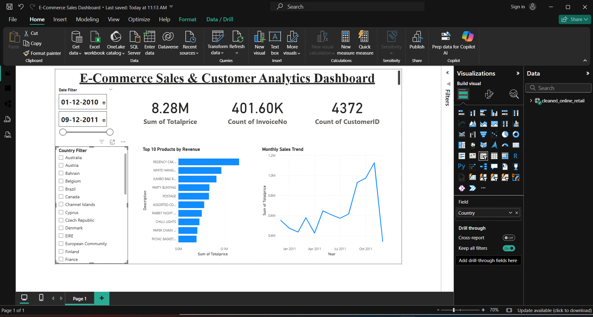

# E-Commerce Analytics Project

## Project Overview

This project analyzes e-commerce transaction data to generate business insights and build data-driven solutions. It covers the complete analytics workflow, including data cleaning, SQL analysis, machine learning, and dashboard visualization.

---

## Tools and Technologies

* Python (Pandas, NumPy, Matplotlib, Seaborn)
* SQL (MySQL)
* Machine Learning (Scikit-learn)
* Power BI

---

## Dataset

The project uses an online retail dataset containing transactional data with the following fields:

* InvoiceNo
* StockCode
* Description
* Quantity
* InvoiceDate
* UnitPrice
* CustomerID
* Country

---

## Project Workflow

### 1. Data Cleaning and Preprocessing

* Removed missing and invalid values
* Converted columns to appropriate data types
* Created a new column: TotalPrice = Quantity × UnitPrice

### 2. Exploratory Data Analysis

* Identified top-selling products
* Analyzed sales distribution by country
* Examined monthly revenue trends
* Explored relationships between variables

### 3. SQL Analysis

* Calculated revenue by country
* Analyzed monthly sales trends
* Identified top-performing products
* Generated customer-level insights

### 4. Machine Learning

* Applied K-Means clustering for customer segmentation
* Grouped customers based on purchasing behavior

### 5. Recommendation System

* Built a customer similarity-based recommendation approach
* Suggested products based on similar customer patterns

### 6. Dashboard Visualization

An interactive Power BI dashboard was created to display:

* Total revenue
* Sales trends over time
* Top products by revenue
* Country-wise performance

---

## Dashboard Preview

---

## Project Structure

Ecommerce-Analytics-Project/
│
├── data.ipynb
├── query.sql
├── cleaned_online_retail.csv
├── online_retail.csv
├── E-Commerce Sales Dashboard.pbix
├── Sales Dashboard.png
├── README.md

---

## Key Insights

* A small number of products contribute significantly to total revenue
* Certain countries dominate overall sales performance
* Customer purchasing behavior varies significantly across segments
* Sales trends show patterns over time

---

## Future Improvements

* Deploy the project as a web-based dashboard
* Use advanced recommendation algorithms
* Integrate real-time data sources
* Enhance dashboard with advanced analytics

---

## Conclusion

This project demonstrates an end-to-end data analytics pipeline using Python, SQL, machine learning, and Power BI to generate meaningful business insights.

---

## Author

Akhil
